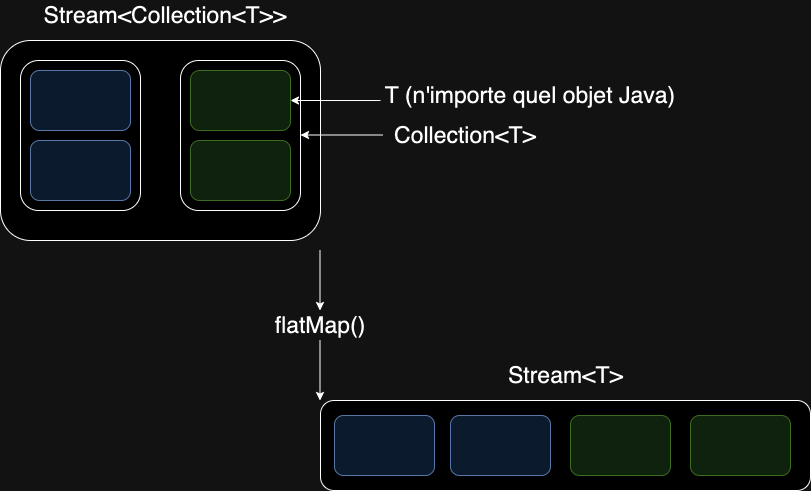

[Retour](../../../index.md)

# Les streams

1. [Comment obtenir un objet stream ?](#stream)
2. [Filtrer des éléments avec la fonction filter()](#filter)
3. [Transformer vos éléments dans un autre type avec map()](#map)
4. [Parcourir une collection de collection avec flatMap()](#flatmap)
5. [Compter vos éléments avec count()](#count)
6. [Récupérer le résultat de votre stream avec collect()](#collect)

## Manipuler vos collections plus facilement

Sortie depuis la version 8, il est devenu beaucoup plus facile de manipuler les collections avec l'API stream de Java. Le code est devenu plus concis et plus lisible, sans avoir besoin de boucles imbriqués, de variable de condition et d'index numérique.

Pour donner un petit exemple, on veux récupérer tous les nombres pairs de cette liste:
```java
List<Integer> numbers = new ArrayList<>();
numbers.add(1);
numbers.add(2);
numbers.add(3);
numbers.add(4);
numbers.add(5);
```

Avant, sans l'API stream:
```java
List<Integer> evenNumbers = new ArrayList<>();
for (int i = 0 ; i < numbers.size() ; i++) {
    if (numbers.get(i) % 2 == 0) {
        eventNumbers.add(numbers.get(i));
    }
}
```

Maintenant avec l'API stream:
```java
List<Integer> evenNumbers = numbers.stream()
    .filter(number -> number % 2 == 0)
    .toList();
```

Dans cette article, je vous montrerais les opérations qui me paraissent les plus importantes à connaître. 

Une petite FAQ accompagnera chaque description de fonction, qui sont simplement des questions que je me suis déjà posé.

## <a name="stream"></a>Comment obtenir un objet stream ?

De base, tous les objets de type `Collection` du package `java.util` (donc les `List`, les `Set` et les `Map` etc.) ont accès à la fonction `stream()` pour les transformer en objet de type `Stream`.

Il suffit d'instancier la variable et d'appeler cette fonction:
```java
List<Integer> numbers = new ArrayList<>();
Stream<Integer> stream = numbers.stream();
```

Mais il est possible d'instancier un `Stream` sans passer par une variable existante:
```java
Stream<Integer> stream = Stream.of(1, 2, 3, 4, 5);
```

### FAQ
- Est-ce que je peux utiliser une même variable `Stream` plusieurs fois ?

Non, une fois instancié et traité, on ne peux plus l'utiliser. Il faut re-instancié une variable `Stream`. On ne peux pas faire:
```java
Stream<Integer> stream = numbers.stream();
List<Integer> numbers2 = stream.collect(Collectors.toList());
List<Integer> numbers3 = stream.collect(Collectors.toList());
```
Une exception sera lancé à l'exécution pour `numbers3`:
```
java.lang.IllegalStateException: stream has already been operated upon or closed
```

## <a name="filter"></a>Filtrer des éléments avec la fonction filter()

Pour filtrer des éléments, il faut faire appel à la fonction `filter` sur un objet `Stream`:
```java
List<Integer> numbers = new ArrayList<>();
Stream<Integer> stream = numbers.stream().filter(/* (argument) */);
```
Elle prend en paramètre une fonction pour trier les éléments. Il faut que cette fonction retourne un booléen. Par exemple pour récupérer tout les éléments inférieurs à 4:
```java
List<Integer> numbers = new ArrayList<>();
Stream<Integer> stream = numbers.stream().filter(number -> number < 4);
```

### FAQ
- Est-ce qu'il est plus performant d'avoir un seul `filter` avec beaucoup de condition ou plusieurs `filters` avec des petites conditions ?

Il est mieux d'avoir un seul `filter`. Un benchmark a été fais sur [Baeldung.com](https://www.baeldung.com/java-streams-multiple-filters-vs-condition). Je vous invite à le lire pour plus de détail.

## <a name="map"></a>Transformer vos éléments dans un autre type avec map()

Pour transformer des éléments, il faut faire appel à la fonction `map` sur un objet `Stream`:
```java
List<Integer> numbers = new ArrayList<>();
numbers.stream().map(/* (argument) */)
```
Elle prends en argument une fonction qui réalise la transformation. Cela peut-être un changement de type, une valeur calculée etc. Le type de retour dépend de votre fonction. Si par exemple vous faîtes:
```java
List<String> names = new ArrayList<>();
names.stream().map(name -> name.toUpperCase())
```
Ici, comme le type de retour de `toUpperCase` est String. Vous êtes passé d'un `Stream<String>` à un `Stream<String>` après la fonction `map`, ce qui ne change rien au type de l'objet.

Par contre, si nous faisons:
```java
List<String> numbers = new ArrayList<>();
numbers.add("0");
numbers.add("1");
numbers.add("2");
numbers.stream() // Stream<String>
    .map(number -> Integer.valueOf(number)) // Stream<Integer>
```
Ici, on transforme des nombres en chaine de caractère, en nombre de type `Integer`. Comme le type de retour de `Integer.valueOf` est `Integer`, on est passé d'un `Stream<String>` à un `Stream<Integer>` après la fonction `map`. On ne pourra pas appeler de méthode de la classe `String` dans la suite du `Stream` vu que le type des éléments a changé. Exemple:
```java
numbers.stream() // Stream<String>
    .map(number -> Integer.valueOf(number)) // Stream<Integer>
    .map(number -> number.toUpperCase()) // Erreur de compilation
```
On ne peux pas appeler la fonction `toUpperCase` car l'élément n'est plus de type `String` mais de type `Integer`.

### FAQ
- Est-ce que je peux utiliser `map` pour appliquer un traitement sur mes éléments sans les transformer ?

Il ne vaut mieux pas, cette fonction n'est pas faite pour. Cela va rendre la lecture du code plus difficile pour d'autre personne qui vont le lire. Elles ne vont pas comprendre pourquoi vous avez utilisé cette fonction. 

Il vaut mieux passer par une boucle `forEach` dans ce cas-là. La fonction `peek` existe aussi, mais selon la [documentation](https://docs.oracle.com/javase/8/docs/api/java/util/stream/Stream.html#peek-java.util.function.Consumer-), elle est destiné seulement à du débuggage.

## <a name="flatmap"></a>Parcourir une collection de collection avec flatMap()

Il peut nous arriver de travailler avec des collections de collections, comme lorsque l'on travaille avec des tableaux à plusieurs dimensions. Généralement, on utilise des boucles imbriquées pour les parcourir.

L'API stream propose une fonction `flatMap` qui permet de mettre à plat tout les éléments de chaque collection dans un stream. Voici un schéma pour expliquer son fonctionnement:


Pour donner un exemple de code, imaginons que l'on ait une classe `User` qui possèdent plusieurs comptes bancaires de type `BankAccount`:
```Java
public class User {
    private List<BankAccount> bankAccounts;
}
```

Dans le cas où l'on voudrait tout les comptes bancaires de plusieurs `User`, on écrirait le code suivant:
```Java
users.stream()
    .flatMap(user -> user.getBankAccounts().stream())
```

La fonction `flatMap` prends en paramètre une fonction qui retourne un `Stream`. Dans notre exemple, nous prenons la liste de compte bancaires de chaque `User` que nous transformons en `Stream`. De cette manière, nous passons d'un `Stream<User>` à un `Stream<BankAccount>`.

Dans le cas où nous aurions utilisé la fonction `map`:
```Java
users.stream()
    .map(user -> user.getBankAccounts())
```
Nous serions passé d'un `Stream<User>` à un `Stream<List<BankAccount>>`. Pour corriger ce problème, il faudrait faire:
```Java
users.stream()
    .map(user -> user.getBankAccounts())
    .flatMap(bankAccounts -> bankAccounts.stream())
```

## <a name="count"></a>Compter vos éléments avec count()

L'API stream propose une méthode `count` qui permet de compter les éléments d'un `Stream`. Généralement, on l'utilise après avoir filtrer nos éléments.

Si nous reprenons l'exemple de `User` ayant plusieurs `BankAccount`, et que l'on rajoute un booléen pour dire c'est un compte est valide ou non:
```Java
public class BankAccount {
    private boolean valid;
}
```
On pourrait compter le nombre de compte valide que possède un `User` en utilisant la fonction `count`:
```Java
bankAccounts.stream())
    .filter(bankAccount -> bankAccount.isValid())
    .count()
```
 
 ## <a name="collect"></a>Récupérer le résultat de votre stream avec collect()

 Une fois que l'on a terminé nos opérations sur un `Stream`, il est possible de récupérer le résultat de nos traitements en utilisant la fonction `collect`.

Cette fonction permet de littéralement collecter tout nos éléments dans un format choisi. On peux les récupérer sous la forme d'une `Collection`, d'une chaîne de caractère etc.

La fonction s'appelle de cette façon:
```Java
numbers.stream()
    .collect(/* (argument) */)
```

Elle prends un argument une fonction qui retourne un objet `Collector`. Il s'agit d'une interface qui appartient au package `java.util.stream`. 

Pour récupérer les élements d'un `Stream` dans un format non standard (un objet custom), il faut implémenter cette interface et la passer à la fonction `collect`.

Dans le cas d'un type standard de Java, il existe des fonctions built-in proposés par l'API.

C'est le cas notamment des `Collections`. Le package `java.util.stream` propose une classe `Collectors` qui donne à accès à des fonctions statiques pour des `Collector` de `List`, des `Set` etc.

Exemple pour avoir un type `List`:
```Java
numbers.stream()
    .collect(Collectors.toList());
```
Ou encore pour un `Set`:
```Java
numbers.stream()
    .collect(Collectors.toSet());
```

Je vous invite à lire la [documentation](https://docs.oracle.com/javase/8/docs/api/java/util/stream/Collectors.html) pour plus d'informations sur les `Collector` disponibles.